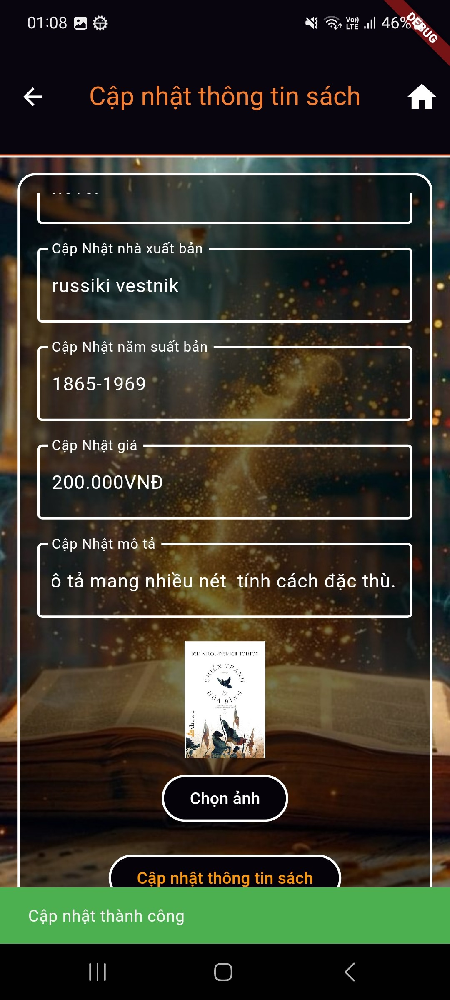
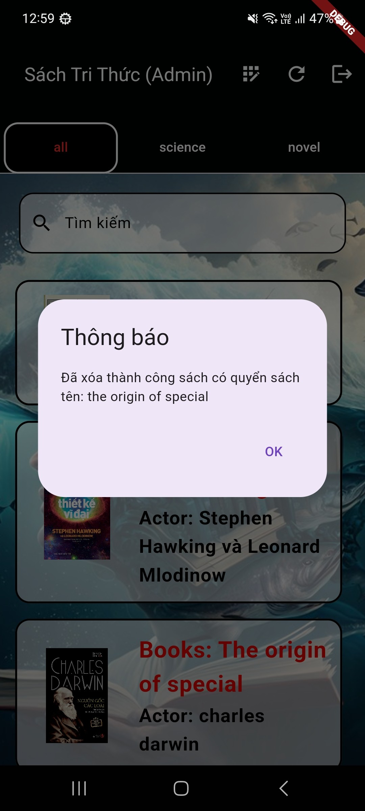
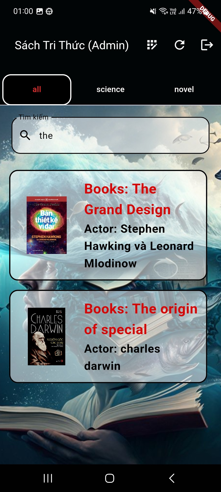
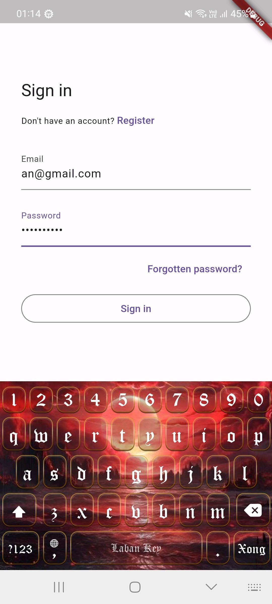
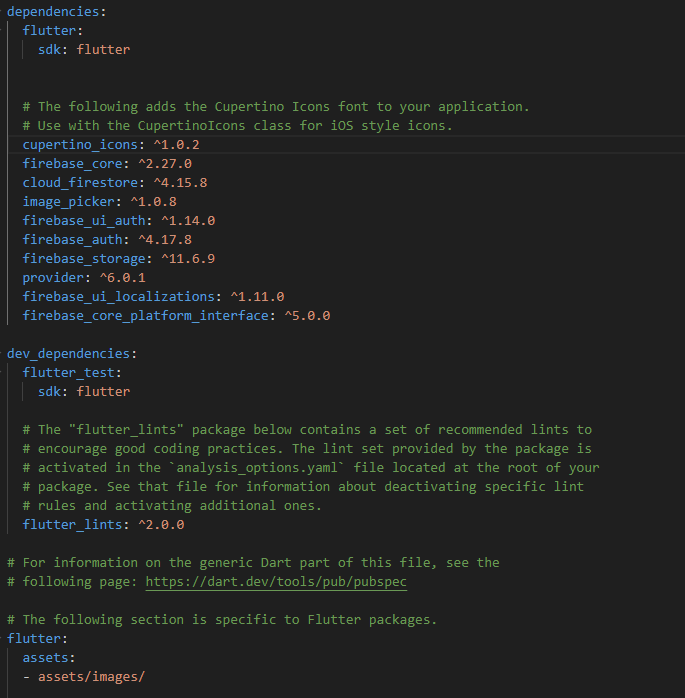

## Ứng dụng Quản lý Sách

!Ứng dụng Quản lý Sách

Ứng dụng Quản lý Sách được xây dựng bằng Flutter và Firebase, cung cấp một giải pháp quản lý sách trực tuyến hiệu quả.

## Chức năng

Ứng dụng bao gồm các chức năng sau:

- **Thêm sách**: Người dùng có thể thêm một cuốn sách mới vào cơ sở dữ liệu, bao gồm tên sách, tác giả, thể loại, nhà xuất bản, ngày xuất bản, giá, mô tả, và hình ảnh sách.

- **Cập nhật sách**: Người dùng có thể cập nhật thông tin của một cuốn sách đã tồn tại trong cơ sở dữ liệu.

- **Xóa sách**: Người dùng có thể xóa một cuốn sách khỏi cơ sở dữ liệu.

- **Xem danh sách sách**: Người dùng có thể xem danh sách tất cả các cuốn sách trong cơ sở dữ liệu. Danh sách này có thể được lọc theo các thể loại khác nhau.

- **Tìm kiếm sách**: Người dùng có thể tìm kiếm sách theo tên hoặc ID.

- **Đăng nhập/Đăng xuất**: Ứng dụng hỗ trợ chức năng đăng nhập và đăng xuất.

- **Quản lý quyền người dùng**: Ứng dụng hỗ trợ quản lý quyền người dùng. Nếu người dùng hiện tại là ‘admin’, họ sẽ có thêm quyền để đăng ký một cuốn sách mới.

## Cài đặt

Ứng dụng yêu cầu Flutter SDK và Firebase để chạy. Sau khi cài đặt Flutter SDK và thiết lập Firebase, bạn có thể chạy ứng dụng bằng cách sử dụng lệnh flutter run trong thư mục gốc của dự án.

- sau khi cài đặt firebase, cần cài thư viện cần thiết 

- tiếp theo là phải thêm code vào main để chạy
Future<void> main() async {
   WidgetsFlutterBinding.ensureInitialized();
  await Firebase.initializeApp(
    
    options: DefaultFirebaseOptions.currentPlatform,
);
  runApp(const MyApp());
}

- khi cài firebase xong, hãy dùng flutter run chạy trong terminal
